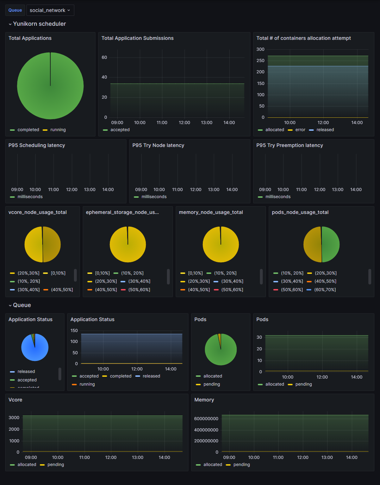
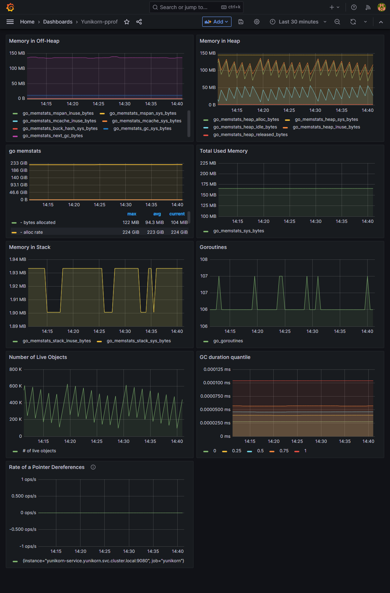

<!--
* Licensed to the Apache Software Foundation (ASF) under one
* or more contributor license agreements.  See the NOTICE file
* distributed with this work for additional information
* regarding copyright ownership.  The ASF licenses this file
* to you under the Apache License, Version 2.0 (the
* "License"); you may not use this file except in compliance
* with the License.  You may obtain a copy of the License at
*
*      http://www.apache.org/licenses/LICENSE-2.0
*
* Unless required by applicable law or agreed to in writing, software
* distributed under the License is distributed on an "AS IS" BASIS,
* WITHOUT WARRANTIES OR CONDITIONS OF ANY KIND, either express or implied.
* See the License for the specific language governing permissions and
* limitations under the License.
-->

# Monitoring Yunikorn Metrics with Grafana

YuniKorn exposes its scheduling metrics through Prometheus. You can utilize Grafana to efficiently organize the data collected by Prometheus into a user-friendly dashboard.

If you haven't built Prometheus for YuniKorn yet, you can refer to the helpful tutorial available in the [YuniKorn documentation](https://yunikorn.apache.org/docs/next/user_guide/prometheus).

We have two JSON files available for you to import into the Grafana dashboard:

* [Yunikorn-metrics](./yunikorn-metrics.json): This dashboard contains YuniKorn scheduler's runtime metrics, such as scheduling execution status and latency, total number of applications, and resource usage. 

  It also includes queue-based application status, number of Pods, and resource usage information.
  

* [Yunikorn-pprof](./yunikorn-pprof.json): This dashboard offers metrics for YuniKorn status based on Go pprof. It includes memory usage, Goroutines, garbage collection duration, and other relevant metrics.
  